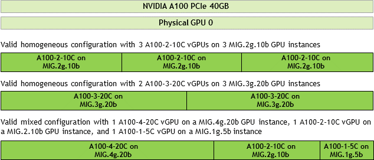

# mig-single



## Purpose

This component is designed to enable to enable MIG in single mode. The single MIG strategy should be utilized when all GPUs on a node have MIG enabled.

To learn more about MIG, please refer to the official [docs](
https://docs.nvidia.com/datacenter/cloud-native/gpu-operator/latest/gpu-operator-mig.html)

## Usage

This component can be added to a base by adding the `components` section to your overlay `kustomization.yaml` file:

```
apiVersion: kustomize.config.k8s.io/v1beta1
kind: Kustomization

resources:
  - ../../base

components:
  - ../../components/mig-single
```

## Specific Checks and Configurations

TBD